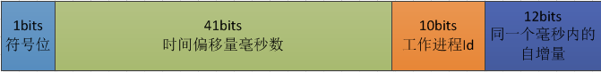

# 借贷公共主键生成器

## 算法描述

借鉴自twitter的snowflake

主键各比特位含义参考下图：



其中，时间偏移量中2017-03-01起算，算法可支持到2086年。

实现方案fork自当当网的开源组件sharding-jdbc

## 特性

1. 生成id号按时间增长有序，可作为默认的order by字段
2. 默认支持host name和ip的id生成器
3. 支持通用的Id生成器，业务方自行决定`workerId`的设置规则
4. 支持单个实例在一毫秒内产生**4096**个id号不冲突，如果冲突则延迟获取
5. 支持同时最大**1024**台机器实例运行不冲突

## id-generator 快速开始

### 引入依赖

```xml

```

### 基于主机名字的ID生成器

```java
/**
 * 根据机器名最后的数字编号获取工作进程Id.如果线上机器命名有统一规范,建议使用此种方式.
 * 列如机器的HostName为:xxx-db-sharding-dev-01(公司名-部门名-服务名-环境名-编号)
 * ,会截取HostName最后的编号01作为workerId.
 */

final IdGenerator idGenerator = new HostNameIdGenerator();
long id = idGenerator.generateId();
```

注意事项：如果线上的服务器的host name没有数值的话，会导致初始化失败。这种场景下，请采用`IPIdGenerator`或者`CommonIdGenerator`。

### 基于IP的ID生成器

```java
/**
 * 根据机器IP获取工作进程Id,如果线上机器的IP二进制表示的最后10位不重复,建议使用此种方式
 * ,例如机器的IP为192.168.1.108,二进制表示:11000000 10101000 00000001 01101100
 * ,截取最后10位 01 01101100,转为十进制364,设置workerId为364.
 */

final IdGenerator idGenerator = new IPIdGenerator();
long id = idGenerator.generateId();
```

### 通用的ID生成器

```java
/**
 * 自生成Id生成器.
 */

final CommonIdGenerator idGenerator = new CommonIdGenerator();
// 设置工作进程Id, 最大不超过1023
idGenerator.setWorkerId(12L);
long id = idGenerator.generateId();
```

工作进程Id可以根据业务进行处理

比如前`5-bit`划分为业务类型，后`5-bit`作为机器实例，完全是可以定制化的

### 指定工作进程Id

约定优先规则

1. 属性参数(常量类`VariableConst.SELF_WORKER_ID_PROPERTY`)
2. 环境变量(常量类`VariableConst.SELF_WORKER_ID_ENV`)
3. 默认值0

属性参数通过`java -Dself.id.generator.worker.id=12`指定

环境变量设置`SELF_ID_GENERATOR_WORKER_ID`=12指定

如果是按照一定的规则生成，可以调用`CommonIdGenerator.setWorkerId(12)`指定